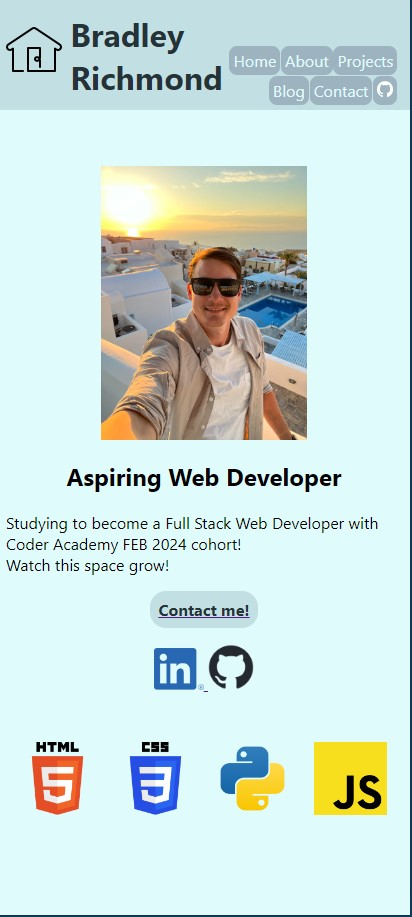
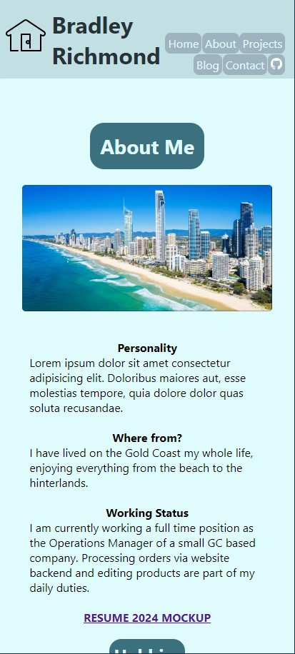
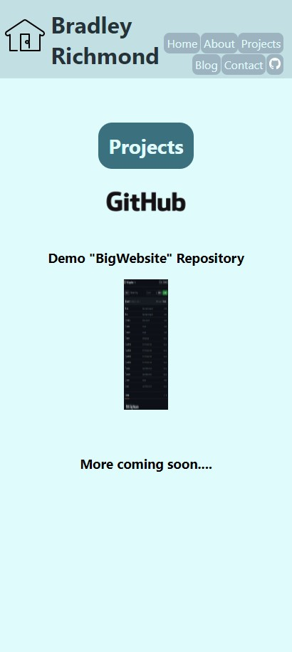
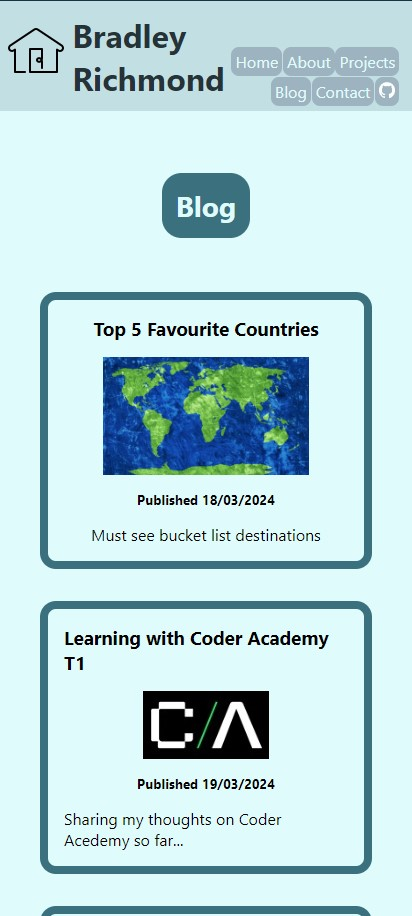
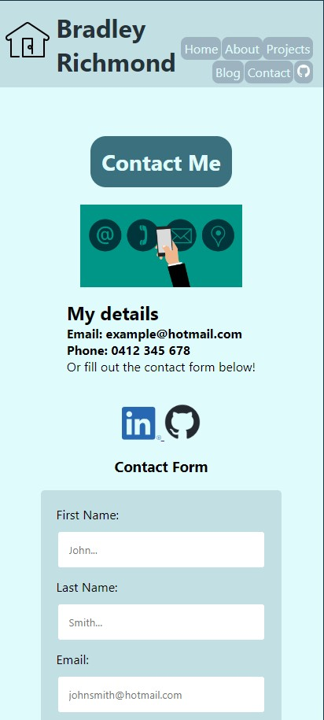

# BradleyRichmond_T1A2

## Publish portfolio website: https://bradrichmondprojects.netlify.app/
## Github Repository link: https://github.com/bradx32/BradleyRichmond_T1A2

### Welcome to my Portfolio Readme file. 

### Purpose:
The purpose of my portfolio website is to work as an online resume, information about me and showcasing my work with project pages and blogs. A represenation of myself to any development or IT professional employers.

The purpose is to provide an online portfolio that provides information about me, my skills, interested, professional knowledge and showcase my work.

### Functionality/features:
- What youre trying to do with the components you created on the site
- How youre trying to grab or bring peoples attention across pages of the site.

- The main functionality of the Home page is 
- My portfolio page features a Navigation bar in the Header section to provide an easy location to jump between the pages. 
- The home page has a 'Contact Me!' link that takes you straight to the contact page where you can fill out a form and submit
- At the beginning of each page there is a colourful and responsive H1 heading with a hover effect. This helps the user engage and navigate across the site.
- There are several links to Socials, Resume, previous projects and my GITHUB repository. These are located with either a image button link or text via 'Home', 'About' and 'Projects' pages.
- I also decided to include a link to Home button with a house icon at the top left of the screen viewport across all pages to navigate back to the home page. This image icon also has a smooth hover effect animation for improved interaction.

### Screenshots:
- Screenshots are from Mobile view as the website is a Mobile first design.
#### Home Page screenshot (Mobile view)

#### Home Page screenshot (Desktop view)

#### About Page screenshot

#### Procjets Page screenshot

#### Blog Page screenshot

#### Contact Page screenshot

#### Sitemap:
- Create

### Target audience: 
The target audience for the portfolio website is an employer looking to engage a dev and/or IT professional.

#### Tech stack
- HTML
- CSS
- Github repository
- Netlify used for deployment platform

## Presentation LINK submission
- Youtube link
- Record using screen recorder?

## Documentation must include below: 

### An overview/sitemap of all the pages on website
- The overall structure of your website and how different pages will be navigated.
- Show images here.

### Wireframes or mockups of the pages of your website
- Your decision making process relating to the overall aesthetic of your website.
- Show images here.

### A list of components that will be used:
- How components and styling will engage the audience.
