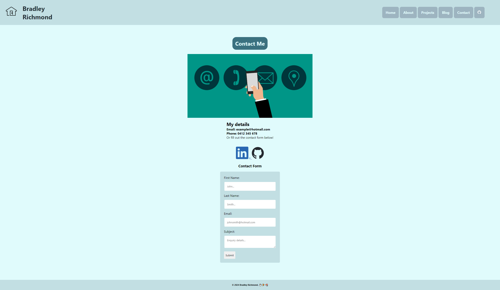
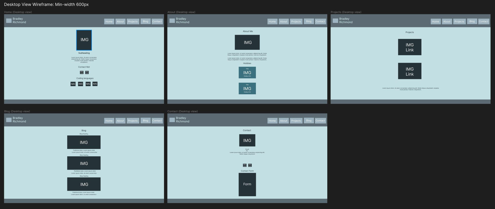

# BradleyRichmond_T1A2

## Publish portfolio website: https://bradrichmondprojects.netlify.app/
## Github Repository link: https://github.com/bradx32/BradleyRichmond_T1A2
## Presentation LINK submission: Youtube link https://youtu.be/JGw3Wx072EY
### Resume: [BradleyRichmond_Resume_Mockup](vscode-local:/Ubuntu/home/bradr/MAR24/BradleyRichmond_T1A2/docs/Bradley%20Richmond%20Resume%20%282024%29%20MOCKUP.pdf)
### Slidedeck readme .pdf: [slidedeckreadme.pdf](vscode-local:/Ubuntu/home/bradr/MAR24/BradleyRichmond_T1A2/docs/SlidedeckREADME.md.pdf)

### Welcome to my Portfolio Readme file. 

### Purpose:
The purpose of my portfolio website is to work as an online resume, provide information about me and showcasing my work with project pages and blogs. A represenation of myself to any developer or IT professional employers. The site will gradually change over time as current work and projects are updated.

### Components (Text)
1. My global style.css stylesheet has a :root font family of "'Segoe UI', Tahoma, Geneva, Verdana, sans-serif" which gives the overall text a nicer look compared to timesnewroman.

2.  Page H2 headings for About, Projects, Blog and Contact all have a common theme styling via my 'special-heading' and 'special-heading:hover' classes contained in a semantic section. Creating a larger text heading with blue/green background, padding and border radius. The hover effect changes the background and text colour.

3.  About page I have created a section class card like flexbox container with text styling to increase text weight and colour to stand out on the different background. This making it much easier on the eye and satisfying to look at

4. The semantic NAV section of my header contains the individual page nav links which have been styled with desktop view extra padding, font-size and font-weight to stand out more than the mobile view with much larger buttons to click on for accessibility.

### Components (Graphical)
1. In my about page hobbies section I have used a class inside of a semantic section called hobbies-container and hobbies-content to create a graphical box around each sectioned content with a flexbox, background-color, text color, font-weights and box-shadows to portray a unique and visualy pleasing content block.

2. The header section of each page has a 'homenav' image which links back to the index.html (home) page of my portfolio. Nested inside of the semantic Header with an id="homeNav". I created this as an easy visual point of navigation back to the Home page of the website on click. This also has a hover effect rotating to the side which ads to the user experience.

3. The Blog page contains sections with a blogcontainer and blogborder which style the individual posts with a solid border, padding, margin, flex box and row gap. Nicely sectioning off each post and creating easy visibility for the viewer.

4. Contact page utilising a contact 'form' inside of a section class called contactContainer, providing a graphical box around the form with a border-radius, background-color, padding and margin. 

### Functionality/features:
- The main functionality of the Home page is to provide a simple brief of myself and how to contact me and show the coding languages I will be working with.
- My portfolio page features a Navigation bar in the Header section to provide an easy location to jump between the pages. 
- The home page has a 'Contact Me!' link that takes you straight to the contact page where you can fill out a form and submit
- At the beginning of each page there is a colourful and responsive H1 heading with a hover effect. This helps engage the user while knowing exactly what page they have navigated to.
- There are several links to Socials (LinkedIn & Github), Resume (mockup), previous projects and my GITHUB repository. These are located with either an image button link or text via 'Home', 'About' and 'Projects' pages.
- I also decided to include a link to Home button with a house icon at the top left of the screen viewport across all pages to navigate back to the home page. This image icon also has a smooth hover effect animation for improved interaction.

### Screenshots:

#### Home Page screenshot (Mobile view)

#### Home Page screenshot (Desktop view)

#### About Page screenshot (Mobile view)

#### About Page screenshot (Desktop view)

#### Procjets Page screenshot (Mobile view)

#### Procjets Page screenshot (Desktop view)

#### Blog Page screenshot (Mobile view)

#### Blog Page screenshot (Desktop view)

#### Contact Page screenshot (Mobile view)

#### Contact Page screenshot (Desktop view)

#### Sitemap:

This is my sitemap which, as you can see there is two levels all contected by the Navbar. My homepage is where my viewers first arrive at when visiting my website. 

From here they can either go directly to the contact page or utilise the Navbar which is located in the header section of each page, on click this will take you to any of the 5 pages; Home, About, Projects, Blog and Contact.

In future a 3rd level will be added once the blog and project pages are functioning with pages linked from them. 

### Wireframes
#### Mobile view

#### Desktop View

#### Wireframes details:
Throughout my portfolio I have kept to a colour scheme across all pages which navigate together with a NAV bar in the header section. I have kept the colours simple and easy on the eye to not draw attention away from the actual content. 

I wanted to use alot of imagery, utilising image links to direct viewers to further content. Each coloured 'gunmetal' square/rectangle represents an image area for the purpose of the wireframing.

Paragraphs were kept concise throughout the site to keep readers focused. Each page has a identical header to keep unity across the website, also with a navigation bar for each main page. 

Home page: I wanted to keep this simple with a main image of myself and short description. I have a link straight to my contact page as well as my professional social links to LinkedIn and Github profile page. This page gives an overall of who I am and the coding languages I am learning to use

About page: This page gets more personal and includes a bit more about my personality, where I am from, my working status and hobbies, while still keeping minimal text to not bore the reader. A link to my resume is also found here if a employer would like more information on me. 

Projects page: My projects page is a work in progress as I don't currently have alot of work to upload here. Although I am excited to add future projects as I continue to learn. Currently has a link to my GITHUB profile page which then can be navigated to all of my public repositorys. The 2nd link goes straight to my biggest repo which is the 'BigWebsite' worked on in study lessons. 

Blog page: My Blog page I have 5 individual blog posts defined by borders around each individual blog. I wanted these sections to be clearly seperated and will eventually have links to pages explaining each topic in detail. Currently I have random blog posts but in future they will be more directed towards which programing employment area I choose to focus on. I included large images on this page so viewers can see clearly what the blog is about while quickly browsing along with published date and some short descriptive text.

Contact page: has my core details such as email and phone number as well as a the contact form option and professional social links. 

### Target audience: 
The target audience I would be after is a Developer/IT employer looking for Junion Developers that have a range of skills on creating simple websites with a set colour scheme, blog post pages and form pages. My home page shows the coding languages I can work with as well as mentioning in my About page that I'm currently studying with Coder Academy, a well known and accredited bootcamp. My portfolio provides a brief description of who I am with an example of the HTML pages I can create with CSS styling.

### Tech stack
- HTML
- CSS
- Github repository https://github.com/bradx32/BradleyRichmond_T1A2
- Netlify used for deployment platform https://app.netlify.com/
- Wireframes were created using https://www.figma.com/
- The website https://app.diagrams.net/ was used for sitemap. I then used windows snipping tool to take a screen grab and save as .jpg file.
- Visual Studio Code used as coding platform for HTML, CSS, Markdown (readme file)
- Ubuntu terminal used to link VS code and push to GITHUB repo.

#### This Readme was used as my slide deck for presentation.