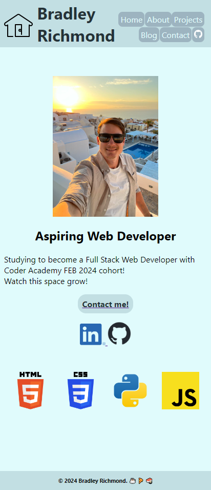

# BradleyRichmond_T1A2

## Publish portfolio website: https://bradrichmondprojects.netlify.app/
## Github Repository link: https://github.com/bradx32/BradleyRichmond_T1A2

### Welcome to my Portfolio Readme file. 

### Purpose:
The purpose of my portfolio website is to work as an online resume, provide information about me and showcasing my work with project pages and blogs. A represenation of myself to any developer or IT professional employers. The site will gradually change over time as current work and projects are updated.

### Functionality/features:
- What youre trying to do with the components you created on the site
- How youre trying to grab or bring peoples attention across pages of the site.

- The main functionality of the Home page is 
- My portfolio page features a Navigation bar in the Header section to provide an easy location to jump between the pages. 
- The home page has a 'Contact Me!' link that takes you straight to the contact page where you can fill out a form and submit
- At the beginning of each page there is a colourful and responsive H1 heading with a hover effect. This helps engage the user while knowing exactly what page they have navigated to.
- There are several links to Socials (LinkedIn & Github), Resume (mockup), previous projects and my GITHUB repository. These are located with either an image button link or text via 'Home', 'About' and 'Projects' pages.
- I also decided to include a link to Home button with a house icon at the top left of the screen viewport across all pages to navigate back to the home page. This image icon also has a smooth hover effect animation for improved interaction.

### Screenshots:

#### Home Page screenshot (Mobile view)

#### Home Page screenshot (Desktop view)

#### About Page screenshot (Mobile view)

#### About Page screenshot (Desktop view)

#### Procjets Page screenshot (Mobile view)

#### Procjets Page screenshot (Desktop view)

#### Blog Page screenshot (Mobile view)

#### Blog Page screenshot (Desktop view)

#### Contact Page screenshot (Mobile view)

#### Contact Page screenshot (Desktop view)

#### Sitemap:

### Target audience: 
The target audience I would be after is a Developer/IT employer looking for Junion Developers that have a range of skills on creating simple websites with a set colour scheme, blog post pages and form pages. My home page shows the coding languages I can work with as well as mentioning in my About page that I'm currently studying with Coder Academy, a well known and accredited bootcamp. My portfolio provides a brief description of who I am with an example of the HTML pages I can create with CSS styling.

### Tech stack
- HTML
- CSS
- Github repository https://github.com/bradx32/BradleyRichmond_T1A2
- Netlify used for deployment platform https://app.netlify.com/
- Wireframes were created using https://www.figma.com/
- The website https://app.diagrams.net/ was used for sitemap. I then used windows snipping tool to take a screen grab and save as .jpg file.
- Visual Studio Code used as coding platform for HTML, CSS, Markdown (readme file)
- Ubuntu terminal used to link VS code and push to GITHUB repo.

## Presentation LINK submission
- Youtube link
- Record using screen recorder?

## Documentation must include below: 

### An overview/sitemap of all the pages on website
- The overall structure of your website and how different pages will be navigated.
- Show images here.

### Wireframes or mockups of the pages of your website
- Your decision making process relating to the overall aesthetic of your website.
- Show images here.

### A list of components that will be used:
- How components and styling will engage the audience.
